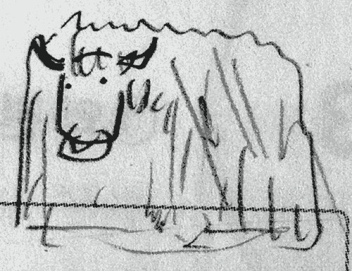

Title: Markdown Guide

Yak uses John Gruber's [Markdown](http://daringfireball.net/projects/markdown/) text formatting syntax for posts. Here are some examples.

You can include code in your post like `this`, or as a code block:

~~~
#include <stdio.h>
int main(){
    printf("안녕하세요?\n");
    return 0;
}
~~~

Embedding images:

Links and unordered list:

* [Download this post](2012-01-01-howto-blog-using-yak.md)
* [Twitter](http://twitter.com/)

Ordered list and footnotes:

1. Get up. [^getting_up]
2. Take a shower. [^1]
3. Code. [^2]

*Emphasis*, **strong emphasis**, 

# First heading
## Second heading
###### ... Through sixth heading

And as you can see, paragraphs are separated by a blank line in between.

If you can't find a syntax you need, you can write raw HTML.

<object style="height: 390px; width: 640px"><param name="movie" value="http://www.youtube.com/v/s3bPg8hRiPw?version=3&feature=player_detailpage"><param name="allowFullScreen" value="true"><param name="allowScriptAccess" value="always"><embed src="http://www.youtube.com/v/s3bPg8hRiPw?version=3&feature=player_detailpage" type="application/x-shockwave-flash" allowfullscreen="true" allowScriptAccess="always" width="640" height="360"></object>

[^getting_up]: The sooner you get up, the better off you are.
[^1]: Be careful not to fall asleep in your shower.
[^2]: Like you didn't hack away yesterday night.
